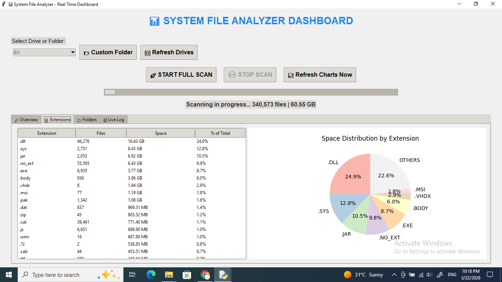
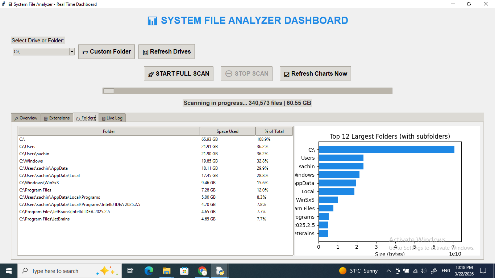

# System File Analyzer Dashboard

A beautiful **real-time Python GUI dashboard** that scans your entire drive/folder and shows:

- Total files & space used (live updating)
- Extension-wise breakdown (pie chart + table)
- Folder-wise space usage (bar chart + table)
- Live log of scanning process

Built with **Tkinter** + **Matplotlib** – no extra heavy frameworks!


## Features
- Real-time progress & stats update
- Pie chart: Space distribution by file extension (top extensions highlighted)
- Bar chart: Top largest folders (including subfolders cumulative)
- Handles permission errors gracefully (skips system protected files)
- Stop scan anytime
- Works on any drive (C:, D:, etc.) or custom folder


## Requirements
- Python 3.8+
- matplotlib (`pip install matplotlib`)


## Installation & Quick Start

1. Clone the repo:
   ```bash
   git clone https://github.com/SACHU11223/system-file-analyzer.git
   cd system-file-analyzer

2. Install dependency (only one!):
  
   pip install matplotlib
   
4. Run the dashboard:
  
   python system_analyzer.py

Select a drive → Click START FULL SCAN → Watch the magic happen!
Note: Scanning full C: drive can take 20–60 minutes depending on size. Start with smaller drive/folder for testing.


## Screenshots




## Future Improvements (Roadmap)
Export report as CSV/PDF
Search/filter in tables
Dark mode toggle
Multi-drive comparison


## Contributing
Pull requests are welcome!
For major changes, please open an issue first.
License
This project is licensed under the MIT License - see the LICENSE file for details.


Made with ❤️ in Kanpur, India
Last updated: March 2026


## MIT License
Copyright (c) 2026 Sachin
Permission is hereby granted, free of charge, to any person obtaining a copy
of this software and associated documentation files (the "Software"), to deal
in the Software without restriction, including without limitation the rights
to use, copy, modify, merge, publish, distribute, sublicense, and/or sell
copies of the Software, and to permit persons to whom the Software is
furnished to do so, subject to the following conditions:
The above copyright notice and this permission notice shall be included in all
copies or substantial portions of the Software.
THE SOFTWARE IS PROVIDED "AS IS", WITHOUT WARRANTY OF ANY KIND, EXPRESS OR
IMPLIED, INCLUDING BUT NOT LIMITED TO THE WARRANTIES OF MERCHANTABILITY,
FITNESS FOR A PARTICULAR PURPOSE AND NONINFRINGEMENT. IN NO EVENT SHALL THE
AUTHORS OR COPYRIGHT HOLDERS BE LIABLE FOR ANY CLAIM, DAMAGES OR OTHER
LIABILITY, WHETHER IN AN ACTION OF CONTRACT, TORT OR OTHERWISE, ARISING FROM,
OUT OF OR IN CONNECTION WITH THE SOFTWARE OR THE USE OR OTHER DEALINGS IN THE
SOFTWARE.

